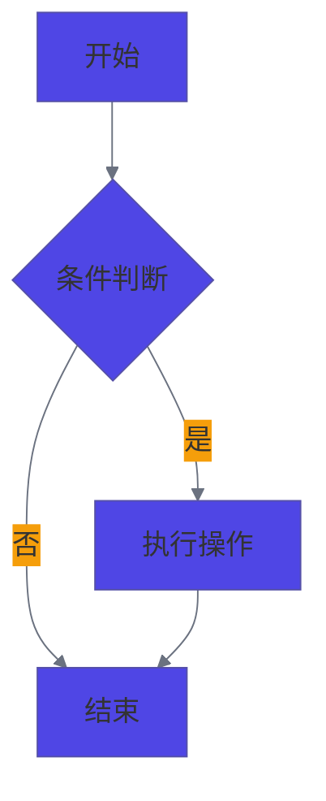

# 文档资源文件

这个目录包含文档相关的资源文件。

## Mermaid 样式配置

### 使用方法

在文档中引用Mermaid样式文件：

```html
<link rel="stylesheet" href="assets/css/mermaid.css" />
```

### 特性

- **增大字体**: 默认16px字体，大屏幕18px，小屏幕14px
- **响应式设计**: 根据屏幕尺寸自动调整字体大小
- **深色主题支持**: 自动适配深色模式
- **多种图表类型支持**: 流程图、序列图、甘特图、饼图等

### 字体大小配置

| 元素类型 | 默认大小 | 大屏幕 | 小屏幕 |
| -------- | -------- | ------ | ------ |
| 节点标签 | 16px     | 18px   | 14px   |
| 边标签   | 14px     | 16px   | 12px   |
| 标题     | 18px     | 20px   | 16px   |
| 子图标题 | 16px     | 18px   | 14px   |

### 自定义配置

如果需要调整字体大小，可以修改 `docs/assets/css/mermaid.css` 文件中的相应CSS规则。

### 示例

````markdown

````

```

这个样式配置会让Mermaid图表在文档中显示得更大更清晰，提高可读性。
```
