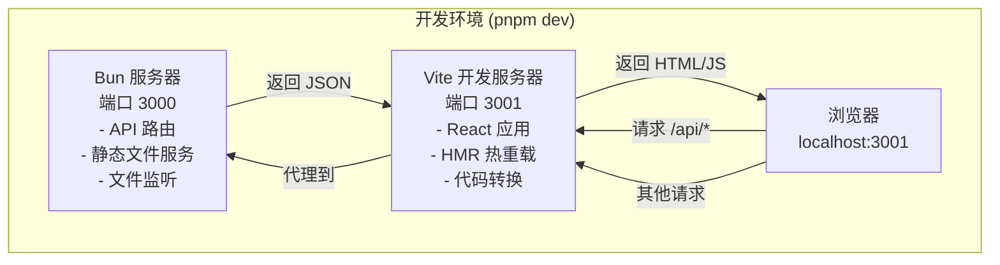
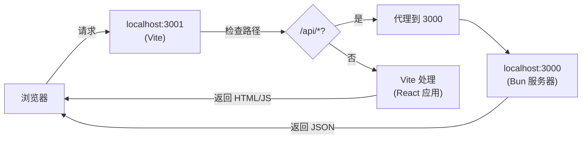
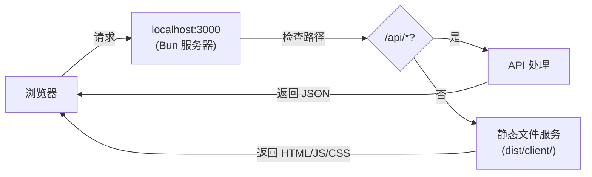

# 架构说明：Bun 服务器与 Vite 客户端协作

## 概述

本项目使用**双进程架构**：Bun 服务器和 Vite 开发服务器并行运行，通过 HTTP 通信。

## 架构图

### 开发环境架构



## 工作流程

### 1. 启动过程

当运行 `pnpm dev` 时：

```bash
# package.json 中的脚本
"dev": "concurrently \"pnpm dev:server\" \"pnpm dev:client\""
```

这会同时启动两个进程：

1. **Bun 服务器** (`dev:server`)

    ```bash
    bun --watch run src/cli.ts
    ```

    - 运行在 `http://localhost:3000`
    - 提供 API 路由 (`/api/*`)
    - 如果 `dist/client` 存在，也提供静态文件服务
    - 监听文件变化，自动重启

2. **Vite 开发服务器** (`dev:client`)

    ```bash
    vite
    ```

    - 运行在 `http://localhost:3001`
    - 提供 React 应用
    - 提供 HMR（热模块替换）
    - 编译 TypeScript/JSX

### 2. 请求流程

#### 开发模式（Vite 运行中）



**Vite 配置中的代理：**

```typescript
// vite.config.ts
server: {
  port: 3001,
  proxy: {
    "/api": {
      target: "http://localhost:3000",  // 代理到 Bun 服务器
      changeOrigin: true,
    },
  },
}
```

这意味着：

- 浏览器访问 `http://localhost:3001/api/workflows`
- Vite 检测到 `/api` 路径
- Vite 将请求代理到 `http://localhost:3000/api/workflows`
- Bun 服务器处理请求并返回响应

#### 生产模式（仅 Bun 运行）



### 3. 文件监听

#### Bun 服务器监听

- 监听 `src/server/**/*.ts` 文件变化
- 使用 `--watch` 标志自动重启服务器
- 监听工作流文件变化（通过 `chokidar`）

#### Vite 监听

- 监听 `src/client/**/*.{ts,tsx,css}` 文件变化
- 自动重新编译并热重载（HMR）
- 不需要重启服务器

## 关键配置

### 1. Vite 配置 (`vite.config.ts`)

```typescript
const clientConfig = defineConfig({
    // 前端构建配置
    server: {
        port: 3001, // Vite 开发服务器端口
        proxy: {
            "/api": {
                target: "http://localhost:3000", // 代理到 Bun
                changeOrigin: true,
            },
        },
    },
});
```

### 2. Bun 服务器配置 (`src/server/index.ts`)

```typescript
// 静态文件服务（生产模式）
if (existsSync('./dist/client')) {
  app.use(staticPlugin({
    assets: './dist/client',
    prefix: '/',
  }));
}

// API 路由
app.get('/api/workflows', ...)
```

### 3. 客户端代码中的 API 调用

```typescript
// src/client/pages/WorkflowCanvas.tsx
fetch("/api/workflows/123");
// ↓
// 在开发模式下，Vite 代理到 http://localhost:3000/api/workflows/123
// 在生产模式下，直接请求 Bun 服务器
```

## 为什么这样设计？

### 优势

1. **开发体验**
    - Vite 提供快速的 HMR（热模块替换）
    - 前端代码修改立即生效，无需刷新
    - Bun 服务器代码修改自动重启

2. **职责分离**
    - Bun：后端 API、文件操作、业务逻辑
    - Vite：前端编译、HMR、开发工具

3. **生产部署**
    - 构建后，只需要 Bun 服务器
    - 静态文件由 Bun 的 `staticPlugin` 提供
    - 不需要 Vite 开发服务器

### 工作模式对比

| 模式 | Bun 端口 | Vite 端口 | 静态文件  | API                  |
| ---- | -------- | --------- | --------- | -------------------- |
| 开发 | 3000     | 3001      | Vite 提供 | Bun 提供（通过代理） |
| 生产 | 3000     | -         | Bun 提供  | Bun 提供             |

## 常见问题

### Q: Bun 如何知道要编译 Vite？

**A:** Bun **不编译** Vite。它们是两个独立的进程：

- Bun 只运行服务器端代码（TypeScript）
- Vite 独立运行，编译前端代码（React/TypeScript）

### Q: 为什么需要两个服务器？

**A:**

- **开发模式**：Vite 提供更好的开发体验（HMR、快速编译）
- **生产模式**：只需要 Bun，静态文件已构建到 `dist/client`

### Q: 如何切换模式？

**开发模式：**

```bash
pnpm dev  # 同时启动 Bun 和 Vite
```

**仅服务器（测试 API）：**

```bash
pnpm dev:server  # 只启动 Bun
```

**生产模式：**

```bash
pnpm build:client  # 构建前端
pnpm start         # 启动 Bun（提供静态文件和 API）
```

## 总结

- **Bun 和 Vite 是独立的进程**，通过 HTTP 通信
- **开发时**：Vite 代理 API 请求到 Bun
- **生产时**：Bun 同时提供静态文件和 API
- **Bun 不编译前端代码**，只运行服务器端代码
- **Vite 不运行后端代码**，只编译和提供前端代码
