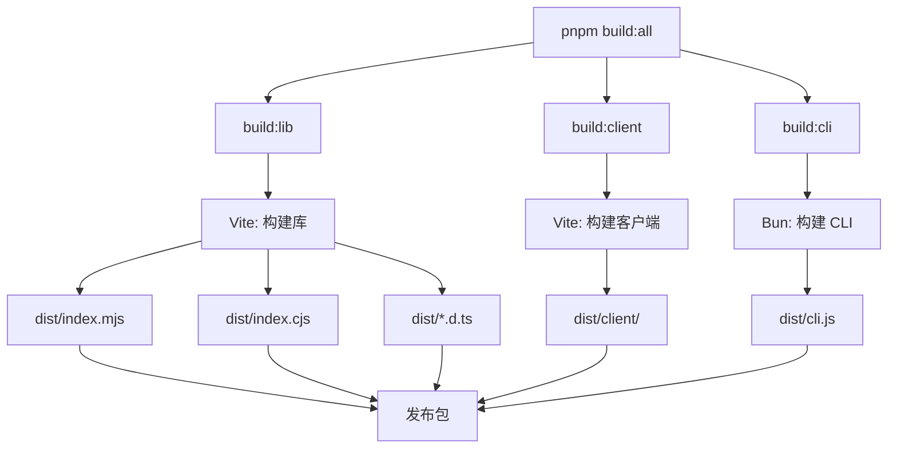

# Bundle 生成说明

本文档说明 `@zouwu-wf/design` 包的 bundle 是如何生成的。

## 构建流程

### 1. 完整构建 (`pnpm build:all`)

```bash
pnpm build:all
# 等同于: pnpm build:lib && pnpm build:client && pnpm build:cli
```

这会执行三个构建步骤：

#### 步骤 1: 构建库 (`pnpm build:lib`)

```bash
vite build  # 使用 libConfig
```

**输入：**

- `src/index.ts` - 库入口
- `src/server/**/*.ts` - 服务器代码
- `src/shared/**/*.ts` - 共享类型

**输出到 `dist/`：**

- `index.mjs` - ES 模块格式
- `index.cjs` - CommonJS 格式
- `index.d.ts` - TypeScript 类型定义
- `*.d.ts` - 其他类型定义文件

**配置：**

```typescript
// vite.config.ts - libConfig
build: {
  lib: {
    entry: "src/index.ts",
    formats: ["es", "cjs"],
  },
  rollupOptions: {
    external: ["react", "react-dom", "elysia", ...],  // 外部依赖
  },
}
```

#### 步骤 2: 构建客户端 (`pnpm build:client`)

```bash
BUILD_CLIENT=true vite build  # 使用 clientConfig
```

**输入：**

- `index.html` - HTML 入口
- `src/client/**/*.{ts,tsx,css}` - React 应用代码

**输出到 `dist/client/`：**

- `index.html` - 入口 HTML
- `assets/*.js` - JavaScript bundles
- `assets/*.css` - CSS 文件
- `assets/*.png|jpg|svg` - 静态资源

**配置：**

```typescript
// vite.config.ts - clientConfig
build: {
  outDir: "dist/client",
  rollupOptions: {
    input: "index.html",  // HTML 入口
  },
}
```

#### 步骤 3: 构建 CLI (`pnpm build:cli`)

```bash
bun build src/cli.ts --outdir dist --target bun --minify
```

**输入：**

- `src/cli.ts` - CLI 入口文件

**输出到 `dist/`：**

- `cli.js` - 打包后的 CLI 可执行文件（包含所有依赖）
- `fsevents-*.node` - 原生模块（如果使用）

**特点：**

- **打包所有依赖**：Bun 会将所有依赖打包到单个文件中
- **独立可执行**：生成的 `cli.js` 可以独立运行
- **优化和压缩**：使用 `--minify` 减小文件大小

**配置：**

```bash
bun build src/cli.ts \
  --outdir dist \        # 输出目录
  --target bun \         # 目标运行时（Bun）
  --minify              # 压缩代码
```

**注意：** Bun 构建会创建一个**独立的 bundle**，包含所有依赖（除了原生模块）。这意味着：

- 文件较大（~1MB），但包含所有依赖
- 不需要安装 `node_modules` 即可运行
- 适合作为 CLI 工具发布

## 构建输出结构

完整构建后的 `dist/` 目录结构：

```
dist/
├── index.mjs              # 库 ES 模块（Vite 构建）
├── index.cjs              # 库 CommonJS（Vite 构建）
├── index.d.ts             # 类型定义（Vite 生成）
├── cli.js                 # CLI 可执行文件（Bun 构建，~1MB）
├── fsevents-*.node        # 原生模块（如果使用）
└── client/                # 客户端应用（Vite 构建）
    ├── index.html
    ├── assets/
    │   ├── index-*.js      # React 应用 bundle
    │   ├── index-*.css     # 样式文件
    │   └── *.png|jpg|svg  # 静态资源
```

## 发布流程

当运行 `npm publish` 时：

1. **prepublishOnly** 钩子自动执行：

    ```bash
    npm run typecheck && npm run build:all
    ```

2. **构建产物：**
    - `dist/index.mjs` - 库 ES 模块
    - `dist/index.cjs` - 库 CommonJS
    - `dist/index.d.ts` - 类型定义
    - `dist/cli.js` - CLI 可执行文件（Bun 构建）
    - `dist/client/` - 前端静态文件

3. **发布的包包含：**

    ```json
    "files": [
      "dist/",      // 包含所有构建产物
      "README.md",
      "ARCHITECTURE.md"
    ]
    ```

4. **bin 入口：**
    ```json
    "bin": {
      "zouwu-design": "./dist/cli.js"
    }
    ```

## 依赖处理

### 外部依赖（不打包）

以下依赖在构建时被标记为 `external`，不会被打包：

- `react`, `react-dom` - React 库
- `elysia`, `@elysiajs/*` - 服务器框架
- `commander` - CLI 框架
- `chokidar` - 文件监听
- `@zouwu-wf/workflow` - 工作流库

这些依赖会在运行时从 `node_modules` 加载。

### 内部依赖（打包）

- `src/server/**/*` - 服务器代码会被打包到库中
- `src/shared/**/*` - 共享代码会被打包到库中

## 构建命令总结

| 命令                | 说明           | 输出                     |
| ------------------- | -------------- | ------------------------ |
| `pnpm build`        | 构建库（默认） | `dist/index.{mjs,cjs}`   |
| `pnpm build:lib`    | 构建库         | `dist/index.{mjs,cjs}`   |
| `pnpm build:client` | 构建客户端     | `dist/client/`           |
| `pnpm build:all`    | 构建全部       | `dist/` + `dist/client/` |
| `pnpm build:cli`    | 构建 CLI       | `dist/cli.js`            |

## 构建工具对比

| 工具     | 用途           | 输入             | 输出        | 特点                     |
| -------- | -------------- | ---------------- | ----------- | ------------------------ |
| **Vite** | 构建库和客户端 | TypeScript/React | ES/CJS 模块 | 快速、支持 HMR、代码分割 |
| **Bun**  | 构建 CLI       | TypeScript       | 独立 bundle | 打包所有依赖、单文件输出 |

## 构建流程总结



## 验证构建

构建完成后，可以验证：

```bash
# 检查文件是否存在
ls -la dist/
# 应该看到: index.mjs, index.cjs, cli.js, client/

# 测试 CLI
bun run dist/cli.js --help

# 测试库导入
node -e "import('@zouwu-wf/design').then(m => console.log(m))"
```
